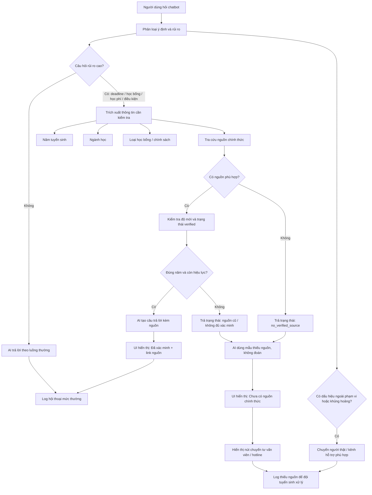

# demo.md - Demo kiến trúc dữ liệu

File này mô tả cách hệ thống giảm rủi ro T-01: AI bịa deadline học bổng 2026 khi chưa có nguồn chính thức.

---

## 1. Sơ đồ cách hệ thống xử lý

---

## 2. Nguồn dữ liệu chính thức

| Nguồn | Dùng để trả lời | Metadata cần lưu | Trạng thái |
|---|---|---|---|
| Website tuyển sinh chính thức | Thông tin ngành, phương thức xét tuyển, deadline chung | URL, năm tuyển sinh, ngày cập nhật, người duyệt | Verified |
| Trang học bổng | Loại học bổng, điều kiện, deadline học bổng, hồ sơ cần nộp | URL, năm tuyển sinh, loại học bổng, ngày cập nhật | Verified |
| Trang học phí | Học phí, lệ phí, khoản thu bắt buộc | URL, năm áp dụng, ngày cập nhật | Verified |
| Đề án tuyển sinh | Quy định xét tuyển, tổ hợp môn, chỉ tiêu | File/URL, năm tuyển sinh, ngày ban hành | Verified |
| FAQ tuyển sinh | Câu hỏi phổ biến đã được ban tuyển sinh duyệt | URL, ngày cập nhật, phạm vi áp dụng | Verified |
| Hotline/email tuyển sinh | Kênh fallback khi thiếu nguồn | Tên bộ phận, thời gian phản hồi, SLA | Human handoff |

---

## 3. Thành phần chính

| Thành phần | Nhận gì? | Làm gì? | Trả ra gì? |
|---|---|---|---|
| Risk classifier | Câu hỏi người dùng | Xác định câu hỏi có liên quan đến deadline, học bổng, học phí, điều kiện xét tuyển hoặc ngoài phạm vi không | `normal`, `high_risk`, `handoff_required` |
| Slot extractor | Câu hỏi rủi ro cao | Trích năm tuyển sinh, ngành, loại học bổng, phương thức xét tuyển | Bộ trường cần tra cứu |
| Official source retriever | Bộ trường cần tra cứu | Tìm nguồn trong danh sách nguồn chính thức | Danh sách nguồn phù hợp |
| Freshness checker | Nguồn tìm được | Kiểm tra đúng năm, ngày cập nhật, trạng thái verified | `verified`, `stale`, `missing`, `conflict` |
| Answer generator | Câu hỏi + nguồn + trạng thái nguồn | Tạo câu trả lời an toàn theo prompt | Câu trả lời kèm nguồn hoặc mẫu thiếu nguồn |
| UI state adapter | Trạng thái nguồn | Chọn nhãn UI: Đã xác minh / Chưa có nguồn / Cần tư vấn viên | UI state |
| Human handoff | Câu hỏi thiếu nguồn hoặc rủi ro cao | Tạo ticket cho tư vấn viên | Ticket + mã theo dõi |
| Monitoring log | Câu hỏi, trạng thái nguồn, kết quả trả lời | Ghi lại lỗi thiếu nguồn, nguồn cũ, người dùng báo sai | Dashboard cải thiện |

---

## 4. Quy tắc kiểm tra trước khi AI trả lời

| Điều kiện | Hệ thống cho AI làm gì? | Hệ thống không cho AI làm gì? |
|---|---|---|
| Có nguồn đúng năm, verified | Trả lời cụ thể, kèm link nguồn và ngày cập nhật | Không được bỏ nguồn |
| Có nguồn nhưng là năm cũ | Nói nguồn cũ, không dùng để xác nhận năm hiện tại | Không được suy deadline năm mới từ năm cũ |
| Không có nguồn | Trả lời thiếu nguồn, chuyển tư vấn viên | Không được đoán ngày, tiền, điều kiện |
| Có nhiều nguồn mâu thuẫn | Nói cần kiểm tra, chuyển người thật | Không được chọn nguồn tiện nhất |
| Người dùng cần quyết định gấp | Ưu tiên hotline/tư vấn viên | Không được tiếp tục suy đoán |
| Câu hỏi ngoài phạm vi | Từ chối ngắn, hướng kênh phù hợp | Không được tư vấn tài chính/y tế/pháp lý |

---

## 5. Khi hệ thống gặp vấn đề

| Khi nào lỗi xảy ra? | Hệ thống làm gì? | Người dùng thấy gì? |
|---|---|---|
| Nguồn chính thức không có dữ liệu | Gắn trạng thái `no_verified_source`, chặn câu trả lời cụ thể, tạo log thiếu nguồn | "Chưa có nguồn chính thức. Chatbot sẽ không đoán ngày." |
| Nguồn bị lỗi hoặc quá chậm | Dùng cache nếu cache còn hiệu lực; nếu không thì fallback thiếu nguồn | "Hiện chưa kiểm tra được nguồn. Vui lòng thử lại hoặc chuyển tư vấn viên." |
| Nguồn quá cũ | Gắn trạng thái `stale_source`, không dùng để xác nhận năm hiện tại | "Nguồn hiện có là năm trước, chưa thể xác nhận cho 2026." |
| Câu hỏi vượt phạm vi AI | Gắn trạng thái `handoff_required` | "Câu hỏi này cần người có thẩm quyền/kênh phù hợp hỗ trợ." |
| Lỗi lặp lại nhiều lần | Dashboard cảnh báo đội tuyển sinh cập nhật nội dung | Người dùng vẫn thấy fallback an toàn; đội nội bộ thấy danh sách cần sửa |

---

## 6. Log theo dõi lỗi

| Trường log | Ví dụ | Dùng để làm gì? |
|---|---|---|
| `question_id` | Q-2026-00091 | Truy vết câu hỏi |
| `risk_type` | scholarship_deadline | Biết nhóm lỗi |
| `slots` | year=2026, major=Kinh tế, scholarship=toàn phần | Biết thiếu nguồn cho trường nào |
| `source_status` | no_verified_source | Biết vì sao AI không trả lời cụ thể |
| `ui_state` | unverified | Kiểm tra UI có cảnh báo đúng không |
| `handoff_created` | true | Theo dõi chuyển tư vấn viên |
| `user_reported` | false | Biết người dùng có báo sai không |
| `created_at` | 2026-05-13 11:40 | Theo dõi theo thời gian |

---

## 7. Dashboard nội bộ tối thiểu

| Chỉ số | Ý nghĩa | Hành động khi cao |
|---|---|---|
| Số câu hỏi `no_verified_source` về học bổng 2026 | Người dùng hỏi nhiều nhưng chưa có nguồn | Cập nhật trang học bổng hoặc FAQ |
| Số lần chuyển tư vấn viên do thiếu nguồn | Hệ thống chưa tự phục vụ được | Ưu tiên bổ sung dữ liệu chính thức |
| Số câu trả lời bị báo thiếu nguồn | Có thể UI/prompt vẫn chưa rõ | Rà lại câu trả lời và nguồn |
| Số nguồn `stale_source` | Nguồn cũ còn được truy xuất | Cập nhật hoặc gỡ nguồn cũ |

---

## 8. Kiểm tra nhanh

- [x] Sơ đồ không chỉ là "AI trả lời tốt hơn", mà có bước kiểm tra cụ thể.
- [x] Có cách xử lý khi thiếu dữ liệu.
- [x] Có cách chuyển sang người thật.
- [x] Có cách theo dõi để lần sau sửa tốt hơn.
- [x] Có kiểm tra nguồn đúng năm tuyển sinh và trạng thái verified trước khi trả lời.
